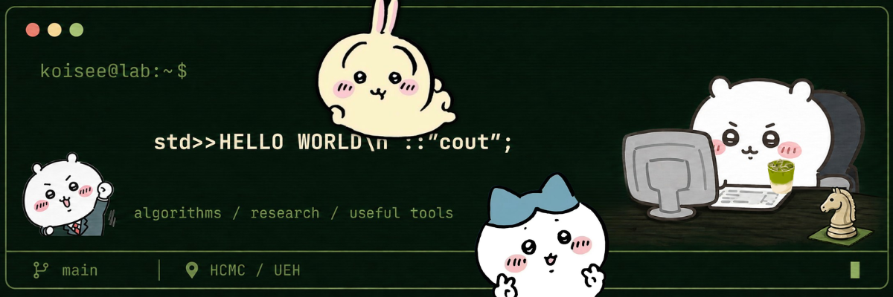
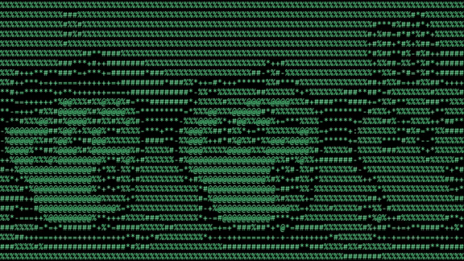

# Lưu Anh Khôi · KoiSee

`dakiemdarktharr` · UEH · Ho Chi Minh City, Vietnam · UTC+7

**Algorithms, research rabbit holes, and tools for everyday annoyances.**

Mình học tại UEH, thích giải bài toán khó, biến ý tưởng nghiên cứu thành thử nghiệm, và làm những tool nhỏ để cuộc sống bớt phiền. Thỉnh thoảng build chỉ vì thấy vui.

I study at UEH and explore problems through research prototypes, useful apps, and the occasional just-for-fun build.

**Open to hackathon teammates & research partners in HCMC — gặp offline được thì càng tốt.**

[Email / Gửi email](mailto:daethphate@gmail.com) · [Instagram / Nhắn mình](https://www.instagram.com/koiluuuuv/) · [Public repos / Các repo công khai](https://github.com/dakiemdarktharr?tab=repositories)

## `> whoami`

- **Core / Thế mạnh:** problem solving & algorithms · giải quyết vấn đề & tư duy thuật toán.
- **Research / Tìm hiểu:** representation learning, game AI, simulation and computer vision · học biểu diễn, AI cho trò chơi, mô phỏng và thị giác máy tính.
- **Build / Làm ứng dụng:** local-first desktop tools, learning apps and human-reviewed AI workflows · công cụ desktop, ứng dụng học tập và workflow AI có người kiểm duyệt.
- **In these repos / Công nghệ trong các project:** C++ / Qt · Python · TypeScript / React / Next.js · Electron · SQLite / MongoDB.

## `> ls featured/`

### [CAISSA-JEPA](https://github.com/dakiemdarktharr/caissa-jepa) · research in progress

Action-conditioned representation learning and planning experiments in two-player games, with explicit baselines, data audits and evaluation protocols.

Nghiên cứu học biểu diễn và lập kế hoạch trong trò chơi hai người; có baseline, kiểm tra dữ liệu và quy trình đánh giá. **Chưa xác lập lợi thế của JEPA so với baseline.**

`Python` · `representation learning` · `game AI`

[Research status / Trạng thái nghiên cứu](https://github.com/dakiemdarktharr/caissa-jepa/blob/main/GROUND_TRUTH.md)

### [VNG Support · DOCRELAY_MLAI2026](https://github.com/dakiemdarktharr/DOCRELAY_MLAI2026) · hackathon demo

A conversational support workflow for MLAI 2026's VNG track: collect missing information, guide the requester, escalate to a human reviewer and retain decision history.

Project hackathon tiếp nhận yêu cầu qua hội thoại, hỏi thêm dữ kiện, chuyển người xử lý khi cần và lưu lịch sử quyết định. **Dữ liệu/quyền trong demo là mô phỏng, không phải hệ thống hỗ trợ chính thức của VNG.**

`TypeScript` · `Next.js` · `MongoDB` · `human-in-the-loop`

[Open demo / Mở demo](https://vng-support.vercel.app/) · [Source & guide / Mã nguồn & hướng dẫn](https://github.com/dakiemdarktharr/DOCRELAY_MLAI2026#readme)

### [WordNest](https://github.com/dakiemdarktharr/WordNest) · offline-first learning

Turn vocabulary TXT files into flashcards, quizzes and spaced-repetition practice. Desktop packages for Windows and macOS; study progress stays on your device.

Nhập TXT để học từ vựng bằng flashcard, luyện gõ, quiz và lịch ôn cách quãng. Giao diện tiếng Việt, có bộ cài desktop; lịch ôn dùng quy tắc rõ ràng, không phải AI sinh nội dung.

`TypeScript` · `React` · `Electron` · `spaced repetition`

[Download / Tải ứng dụng](https://github.com/dakiemdarktharr/WordNest/releases/latest) · [Hướng dẫn tiếng Việt](https://github.com/dakiemdarktharr/WordNest/blob/HEAD/docs/INSTALL.vi.md)

Web-build screenshot with sample vocabulary / Ảnh demo bản web với từ vựng mẫu. Click for the full workflow / Bấm để xem đầy đủ.

### [Who's free, gdmit](https://github.com/dakiemdarktharr/WHOS_FREE_GDMIT) · group scheduling

Everyone marks their busy hours; the app ranks shared times with the fewest conflicts, taking timezones into account.

Đỡ hỏi “khi nào mọi người rảnh?” trong group chat: mỗi người đánh dấu giờ bận, ứng dụng tìm khung giờ ít trùng lịch nhất.

`TypeScript` · `Next.js` · `MongoDB` · `Socket.io` · `Three.js`

[Open demo / Mở demo](https://whos-free-gdmit.vercel.app/) · [Source & setup / Mã nguồn & hướng dẫn](https://github.com/dakiemdarktharr/WHOS_FREE_GDMIT#readme)

## `> ls more_projects/`

### Useful tools / Công cụ dùng hằng ngày

- **[Codeforces Alarm](https://github.com/dakiemdarktharr/code_force_alarm)** — Windows tray reminders for rated Codeforces contests, with desktop alerts and optional Gmail. / Nhắc contest Codeforces qua Windows và Gmail tùy chọn. [Download / Tải](https://github.com/dakiemdarktharr/code_force_alarm/releases/latest).

App interface / Giao diện ứng dụng.

- **[ASCII Video C++](https://github.com/dakiemdarktharr/ascii-video-cpp)** — C++20/Qt/OpenCV image-to-ASCII and video-to-ASCII desktop app, with MP4/GIF export. / Chuyển ảnh, video thành ASCII và xuất media cho README; video xuất ra chưa có âm thanh. [Download / Tải](https://github.com/dakiemdarktharr/ascii-video-cpp/releases/latest).

**▶ ASCII in action / Demo ASCII**

[Full video / Video đầy đủ](https://github.com/dakiemdarktharr/dakiemdarktharr/blob/main/assets/ascii-video/ascii-video.mp4) · [How it works / Cách sử dụng](https://github.com/dakiemdarktharr/ascii-video-cpp#use-the-app)

Converted animation showcase; underlying animation and characters belong to their respective creators.

### AI workflows / Workflow AI

- **[Escala](https://github.com/dakiemdarktharr/Escala)** — Seller-support MVP with message triage, evidence-backed reply drafts and human approval. / Hộp thư hỗ trợ người bán, phân loại yêu cầu và duyệt phản hồi. **Synthetic demo; delivery is simulated, no real marketplace messages or order changes. / Demo mô phỏng, không gửi tin hay sửa đơn hàng thật.**

### Experiments & practice / Thử nghiệm & luyện tập

- **[Fly Piano Lab](https://github.com/dakiemdarktharr/eureka-fly-piano)** — Motor-readout optimization, neuron-activity inspection and 3D replay in a fly simulation. / Thử nghiệm điều khiển vận động và trực quan hóa tín hiệu neuron. **Simulation research, not proof of biological piano learning or a whole-brain digital twin.**

V5 simulation viewer / Giao diện mô phỏng V5. Model signals, not biological recordings / Tín hiệu mô hình, không phải đo đạc sinh học.

- **[Palmistry](https://github.com/dakiemdarktharr/palmistry)** — Python palm-line segmentation experiment. / Thử nghiệm phân đoạn đường chỉ tay; repo chưa kèm dataset hoặc checkpoint huấn luyện. Image processing, not personality or future prediction.
- **[No vibe, only brute force](https://github.com/dakiemdarktharr/code_force-no-vibe-only-brute-force-)** — My C++ competitive-programming practice log. / Góc luyện thuật toán C++: bài nhỏ, nghĩ không nhỏ.

## `> team_up --location hcm`

Have a research question, a hackathon, or a small useful idea? Let's figure it out together. I bring problem solving and algorithmic thinking; we can discuss the topic, roles and schedule.

Bạn có đề tài nghiên cứu, hackathon muốn tham gia hoặc một tool muốn làm? Mình tìm bạn ở **TP.HCM có thể gặp offline**, cùng chia việc, thử nghiệm và build đến nơi đến chốn.

**Say hi with / Nhắn mình kèm:** your idea or event, what you want to work on, and when you can meet · ý tưởng/cuộc thi, phần bạn muốn làm và lịch có thể gặp.

[daethphate@gmail.com](mailto:daethphate@gmail.com) · [@koiluuuuv](https://www.instagram.com/koiluuuuv/)

## `> cat side_quests.txt`

Chess / Cờ vua · League of Legends / Liên Minh Huyền Thoại · Matcha · Chiikawa

*One more idea. One more game. Maybe both.*

Personal fan-art banner; Chiikawa characters belong to their respective creators. No affiliation. Project descriptions reviewed on 2026-10-01; research prototypes and demos are labeled separately from downloadable tools.
